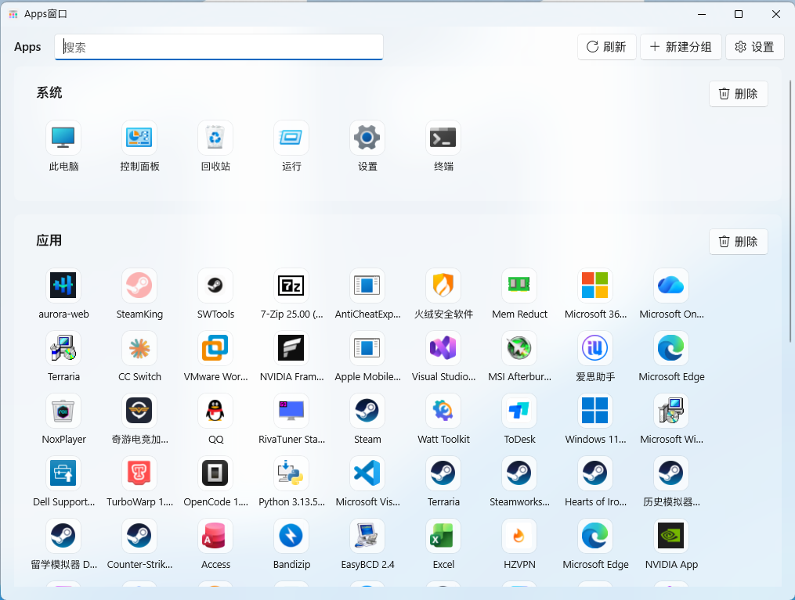
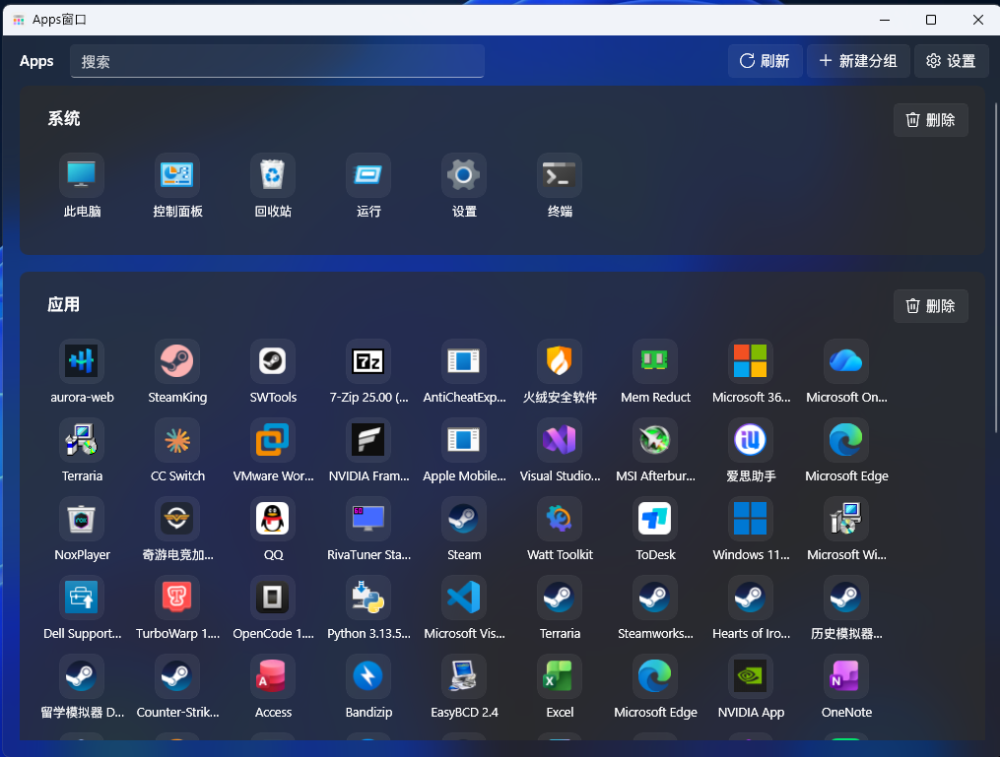

# DesktopOrganizer

DesktopOrganizer, an app that can open apps/desktop files, inspired by macOS 26+.

> **UI language: Chinese only.** Built with **WinUI 3** (Windows App SDK) for native Windows 11 Mica/Acrylic visuals.



* 该展示图已替换苹方字体，请以实际效果为准

## About

This project was built with **VibeCoding** — the code was written through iterative
conversations with an AI assistant rather than hand-written line by line. It's a personal
utility project, not a polished commercial product; expect some rough edges.

## What it does

- Scans your real Windows desktop and groups items into **Apps** and **Files**
- Also pulls in installed programs (from the Registry) and detected game shortcuts,
  so everything launchable lives in one place
- Fully custom, drag-to-rearrange grouping — you decide how things are organized,
  nothing is auto-sorted permanently
- Built-in system shortcuts pinned at the top: This PC, Control Panel, Recycle Bin, Settings, etc.
- Click an icon to launch it directly; right-click for more actions (open, uninstall,
  view shortcut target, delete)
- Deleting a real file sends it to the Recycle Bin (recoverable), never a permanent delete
- Local icon cache for fast reloading, with a one-click "clear cache" option
- Toggleable rounded/square icon style (macOS-like) vs. native Windows icon rendering
- Lightweight built-in search that filters only what's already loaded in the window
  (no disk-wide search, no network calls)
- No background process, no autostart, no system tray — the app opens and closes cleanly,
  nothing lingers after you close the window

## Requirements

- Windows 11 (Mica falls back to Acrylic automatically on Windows 10)
- .NET 10 SDK
- Visual Studio 2022 with the "Windows App SDK" / WinUI 3 workload, to build from source

## Building

```bash
dotnet build
```

or open `DesktopOrganizer.csproj` in Visual Studio 2022 and press F5.

## License

Licensed under the **GNU General Public License v3.0 (GPL-3.0)**.
See [LICENSE](./LICENSE) for the full text — you're free to use, study, modify, and
redistribute this software, as long as derivative works are also released under GPL-3.0.

## Credits

Built by [_Caihongmao_](https://space.bilibili.com/) with the help of an AI coding assistant.
No third-party service or platform (including game platforms this app can detect
installed titles from) is affiliated with or endorses this project.
